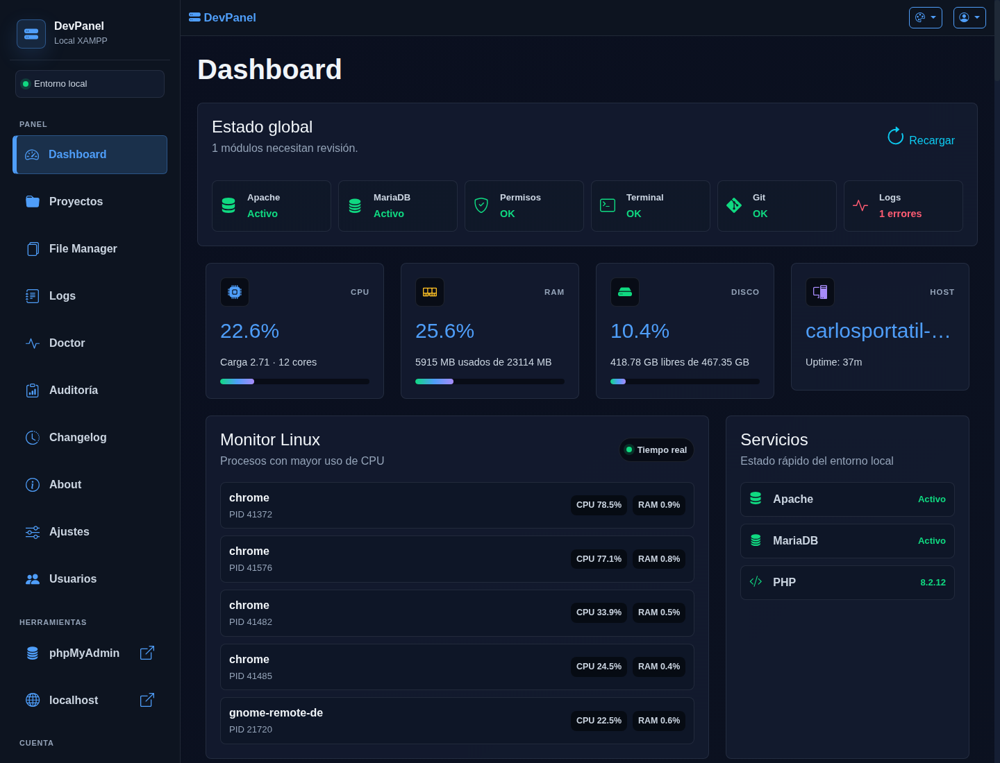
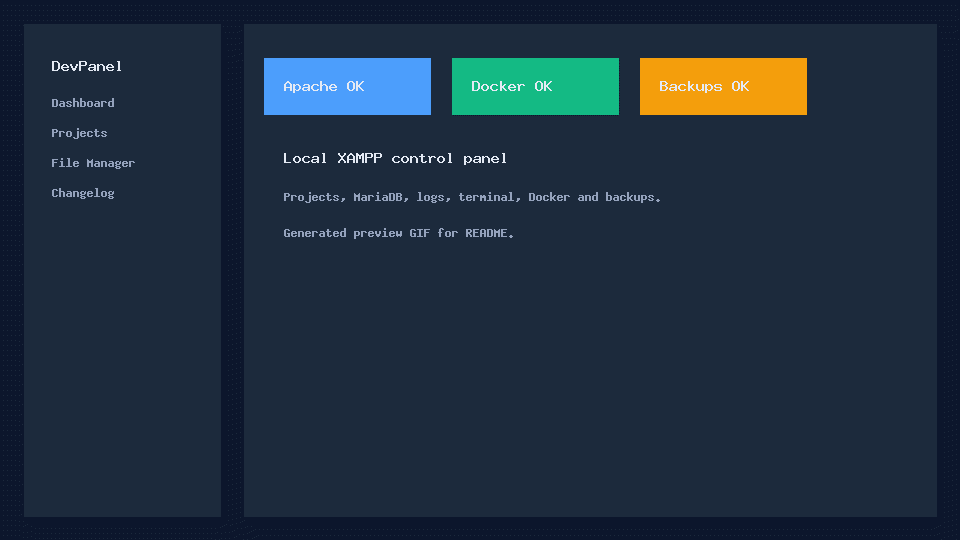
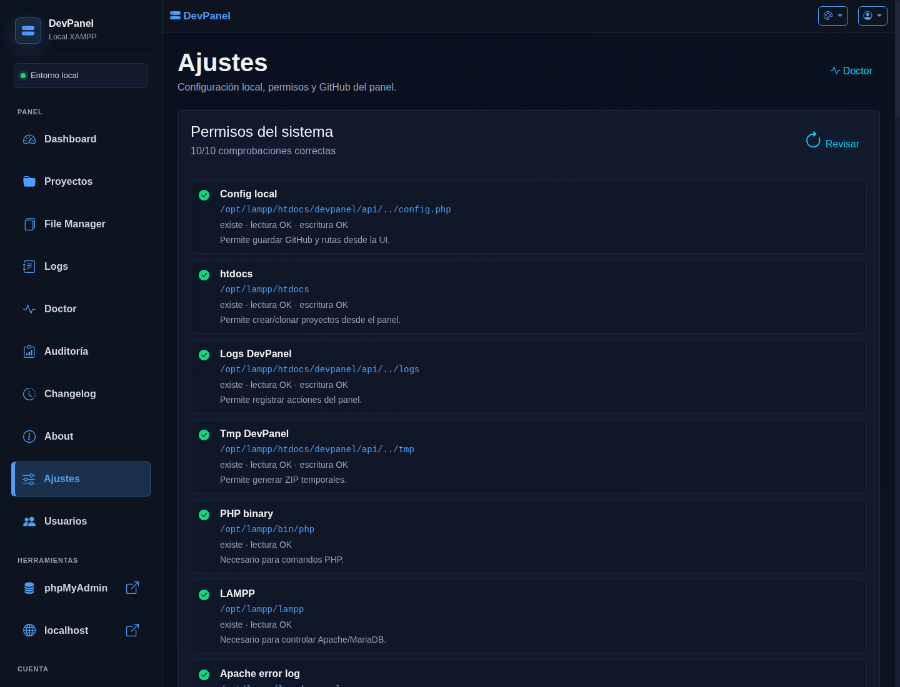
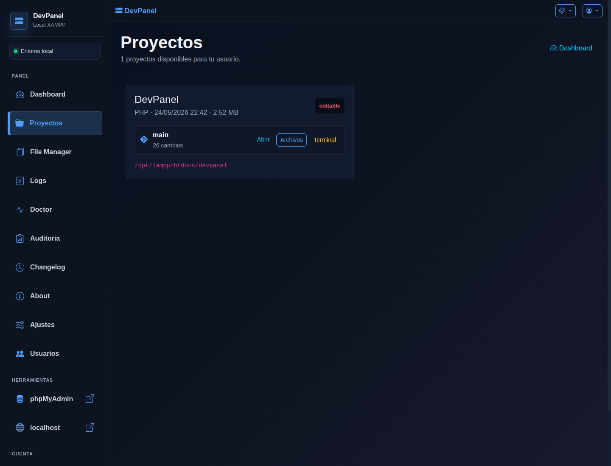
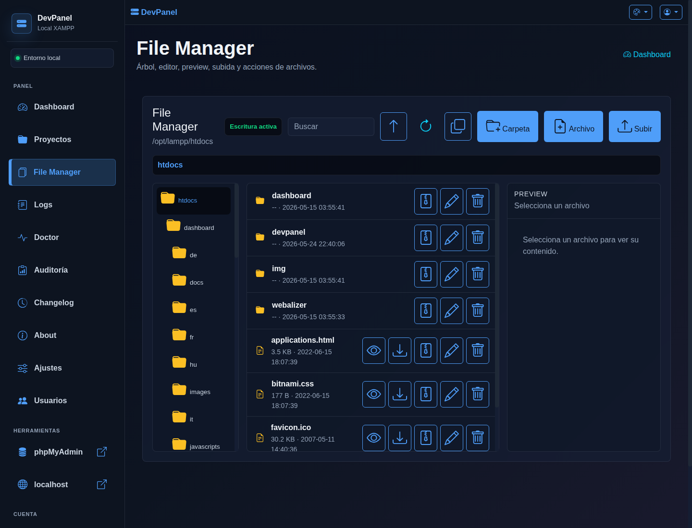
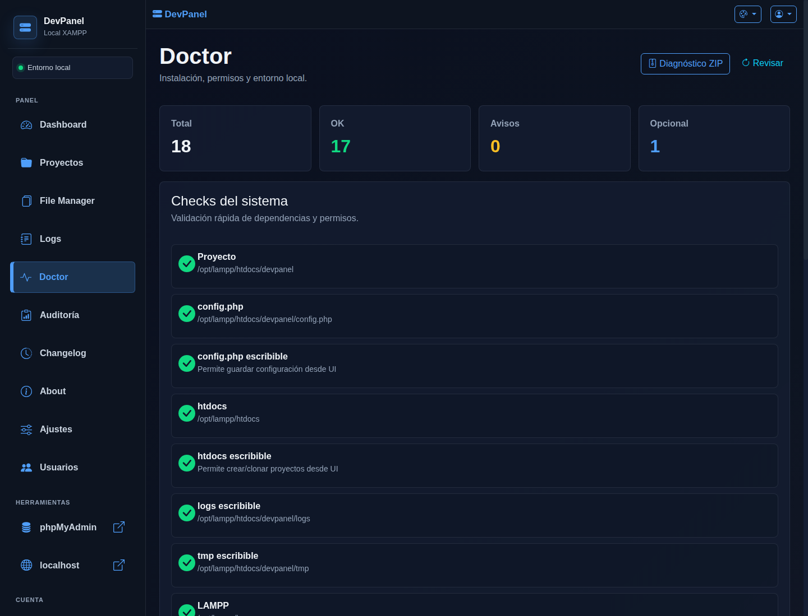
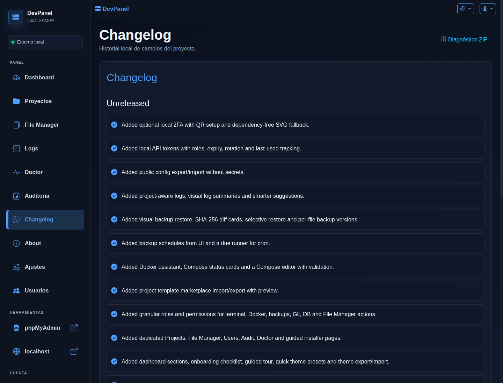
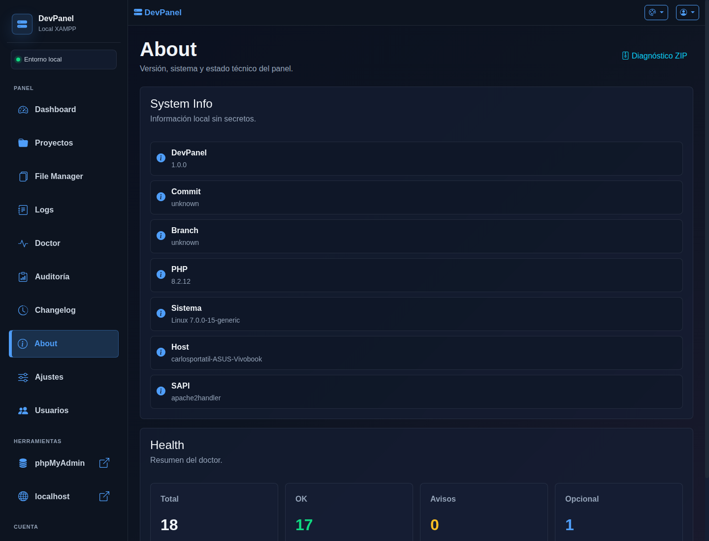

# DevPanel 🚀


DevPanel is a lightweight development panel for Ubuntu built with PHP, XAMPP and JavaScript, designed to centralize and simplify the workflow of web development environments.

The project provides a modern interface to manage services, projects, deployments and Linux tools directly from the browser.

---

# ✨ Features

## 🔐 Security (NEW)

* Password authentication with bcrypt
* CSRF token protection
* Rate limiting (5 attempts in 15 min)
* Session security (httponly, samesite)
* Security headers (CSP, X-Frame-Options)
* Complete audit logging
* Output sanitization (XSS prevention)
* Change password functionality
* Optional TOTP two-factor authentication
* Local API tokens with role, expiration and last-used tracking
* Dedicated audit page with filters

## 🔧 Service Management

* Start/Stop Apache
* Start/Stop MariaDB
* Real-time service status

## 📁 Project Management

* Automatic project detection
* Project type detection (Laravel, WordPress, PHP, Node, Composer, Static)
* Project templates from UI (PHP, Static HTML, Node/Vite, Laravel starter, WordPress starter)
* Recent project activity
* Recent files, panel actions and Git commits per project
* Open projects in browser
* Open folders directly in Linux
* Open projects in VS Code

## 📦 Deploy & Export

* ZIP export generation
* FTP / Strato deployment
* Dynamic deploy modal

## 🖥 System Tools

* Linux terminal integration
* Per-project terminal working directory
* Open the terminal directly from a project card
* Copy latest terminal output
* Real-time Apache logs
* System monitoring
* CPU / RAM / Disk usage
* Global health panel for services, permissions, terminal, Git and logs
* Visual log dashboard grouped by security, permissions, PHP, Apache and MariaDB
* Project-aware log suggestions grouped by project and likely cause
* Persistent notification center
* Docker detection and container actions
* Docker Compose detection and basic actions
* Docker Compose editor with validation
* Local domains helper for `.test` Apache vhosts
* Optional automatic local domain apply with sudo fallback commands
* Local domain response check
* Log insights for recent errors and warnings
* Visual backup restore by file tree
* Docker setup assistant with install commands and daemon checks
* Local project template marketplace
* Template preview before import

## 🎨 UI

* Modern Bootstrap 5 interface
* Responsive layout
* Sidebar navigation
* Dedicated settings page for runtime config, permissions and GitHub
* Dashboard cards
* Dark, Cyber, Ubuntu and Glass themes
* Optional users and roles configuration
* Per-action permissions for sensitive actions
* Browser-local theme customizer
* Theme preset export/import
* First-run onboarding checklist
* Guided dashboard tour
* Built-in quick theme presets

---

# 🛠 Technologies Used

* PHP 7.4+
* JavaScript
* Bootstrap 5
* XAMPP
* MariaDB
* Apache
* xterm.js
* Ubuntu Linux
* lftp
* bcrypt (password hashing)

---

# 📂 Project Structure

```text
devpanel/
├── api/                     # API endpoints
├── assets/                  # CSS & JS
│   ├── css/
│   └── js/
├── includes/                # PHP utilities
├── layout/                  # Header, Sidebar
├── sections/                # Dashboard partials
├── themes/                  # Theme files
├── logs/                    # Audit logs
├── tmp/                     # Temporary files
├── config.example.php       # Public configuration template
├── config.php               # Local private configuration, ignored by Git
├── setup.php                # Initial setup
├── login.html               # Login page
├── change_password.php      # Password change
├── index.php                # Dashboard
└── README.md
```

---

# ⚙️ Installation

## 1. Install XAMPP

Download XAMPP for Linux:
https://www.apachefriends.org/

## 2. Clone repository

```bash
git clone https://github.com/YOUR_USER/YOUR_REPOSITORY.git
```

## 3. Move project to htdocs

```bash
sudo mv DevPanel /opt/lampp/htdocs/devpanel
```

## 4. Set initial password

```bash
http://localhost/devpanel/setup.php
```

Enter your password (minimum 12 characters) and confirm. This page will auto-delete after first use.

For public repositories, do not commit your local `config.php`. Use `config.example.php` as the template and let each user generate their own configuration.

## 5. Start XAMPP

```bash
sudo /opt/lampp/lampp start
```

## 6. Open browser

```
http://localhost/devpanel/login.html
```

---

# 🔑 Password Management

### Initial Setup
1. Visit `http://localhost/devpanel/setup.php`
2. Enter your password (12+ characters)
3. The setup page auto-deletes for security

### Change Password
**Option 1 - From Panel (Recommended):**
- Login to DevPanel
- Navigate to "Cambiar Contraseña" in sidebar
- Enter current password + new password

**Option 2 - Manual:**
```bash
php -r "echo password_hash('new_password', PASSWORD_BCRYPT, ['cost' => 10]);"
```
Then update `/config.php` with the generated hash.

---

# 🛡️ Security Features

### Authentication
- ✅ Bcrypt password hashing (PASSWORD_BCRYPT)
- ✅ Secure password verification
- ✅ Session timeout (1 hour)

### Request Protection
- ✅ CSRF tokens on all POST requests
- ✅ HTTP method validation
- ✅ Input sanitization
- ✅ Output encoding (XSS prevention)

### Rate Limiting
- ✅ Maximum 5 failed login attempts
- ✅ 15-minute lockout window
- ✅ Per-IP tracking

### Session Security
- ✅ HttpOnly cookies
- ✅ SameSite=Strict
- ✅ Secure flag enabled

### Headers
- ✅ Content-Security-Policy
- ✅ X-Frame-Options: DENY
- ✅ X-Content-Type-Options: nosniff
- ✅ X-XSS-Protection

### File Protection
- ✅ config.php blocked from direct access
- ✅ logs/ directory protected
- ✅ tmp/ directory protected
- ✅ .git/ directory protected

### Audit Logging
- ✅ All actions logged to `/logs/actions.log`
- ✅ Includes timestamp, IP, user, action
- ✅ Security events tracked

---

# 📌 Current Features

* ✅ Apache control
* ✅ MariaDB control
* ✅ Linux folder opening
* ✅ VS Code integration
* ✅ ZIP generation
* ✅ FTP deploy
* ✅ Logs viewer
* ✅ Terminal integration
* ✅ Project detection
* ✅ Project activity viewer
* ✅ Theme system
* ✅ MariaDB manager
* ✅ Docker detection
* ✅ Docker Compose UI
* ✅ Local domains helper
* ✅ Project backups with downloadable history
* ✅ Scheduled backups UI with cron-ready due runner
* ✅ Run scheduled backups manually and inspect per-schedule history
* ✅ Delete individual backups and clean old backup history from UI
* ✅ Backup restore with safety backup
* ✅ Backup preview and restore into a new folder
* ✅ Per-file backup version history
* ✅ Backup compare hints before restore
* ✅ Cron-ready backup runner
* ✅ Log insights
* ✅ API smoke test script for dashboard, assets, terminal, Git, File Manager and APIs
* ✅ Functional smoke test for File Manager writes, backups, selective restore, template import and Docker assistant
* ✅ Visual Chromium smoke test for dashboard, installer, Doctor, users, projects, File Manager, settings and audit controls
* ✅ Guided installer with readiness summary, actionable steps and Doctor checks
* ✅ Permissions diagnostics
* ✅ Dedicated settings page
* ✅ System monitor
* ✅ Password authentication
* ✅ Local users and role management
* ✅ Change password functionality
* ✅ Audit logging
* ✅ CSRF protection
* ✅ Rate limiting

---

# 🔒 Security Notes

DevPanel is intended for:

* local environments
* development environments
* personal workflows
* community use

### Security Best Practices

1. **Use Strong Passwords** - Minimum 12 characters recommended
2. **Don't Expose Publicly** - This is not designed for internet-facing deployments without additional security
3. **Regular Backups** - Backup your projects regularly
4. **Keep Updated** - Pull latest security updates
5. **Review Logs** - Check `/logs/actions.log` regularly
6. **Keep Local Config Private** - Never commit `config.php`, real passwords, database credentials or personal remotes

### Public Repository Notes

- `config.php` is intentionally ignored.
- `config.example.php` is the safe template for other users.
- GitHub settings are entered from the UI by each user.
- Screenshots and docs should avoid showing private paths, tokens, usernames or repository URLs.

### Users and Roles

DevPanel still supports the original single-password login. For public/community setups, each user can define local users in `config.php` without committing private hashes:

```php
'DEVPANEL_USERS' => [
    'admin' => [
        'password' => 'BCRYPT_HASH_HERE',
        'role' => 'admin',
    ],
],
```

Keep `config.php` private. Commit only `config.example.php`.

### Local Permissions Checklist

DevPanel needs the web server user to read/write a few local paths. Check the dashboard section **Permisos del sistema** after installation.

Typical local paths:

- `config.php`: writable if the UI should save GitHub and runtime settings.
- `logs/`: writable for audit logs and notifications.
- `tmp/`: writable for ZIP generation.
- `HTDOCS_PATH`: writable if the panel should create or clone projects.
- XAMPP logs: readable for the logs viewer.

Keep these permissions local to your development machine. Do not expose DevPanel directly to the public internet.

Permission helper:

```bash
./scripts/fix-local-permissions.sh
FIX_HTDOCS=1 ./scripts/fix-local-permissions.sh
```

Use `FIX_HTDOCS=1` only when you want DevPanel to create or clone projects directly under `/opt/lampp/htdocs`.

### Powerful Endpoints

The following features intentionally control local developer tools and should stay behind login on localhost/private networks:

- Terminal commands
- Service control
- Git actions
- Docker actions
- File Manager writes/uploads
- MariaDB import/export/delete
- FTP deploy

### Release Checklist

Before publishing a public release:

- Confirm `config.php` is ignored and not staged.
- Confirm `.env`, ZIP files, logs and temporary files are ignored.
- Search for private usernames, tokens, passwords and personal repository URLs.
- Run PHP lint across the project.
- Run `./scripts/devpanel-release-check.sh`.
- Run `scripts/devpanel-api-smoke.sh` with `DEVPANEL_TEST_PASSWORD` locally.
- Use `DEVPANEL_SMOKE_WRITE=1` only when you want the smoke test to create a real backup.
- Open the dashboard and check **Permisos del sistema**.
- Test login, project listing, File Manager, logs and MariaDB on a fresh local setup.
- Generate fresh screenshots with `DEVPANEL_TEST_PASSWORD=your_password ./scripts/devpanel-screenshots.sh`.

### Default Restrictions

- Only whitelisted commands are allowed in terminal
- Only whitelisted paths can be accessed
- Only authenticated users can perform actions
- All actions are logged

---

# 📝 Allowed Terminal Commands

For security, only these commands are allowed:

- `pwd`
- `ls`, `ls -la`
- `git status`, `git branch`
- `php -v`
- `composer --version`
- `composer install`
- `npm --version`
- `npm install`
- `npm run build`
- `npm test`

The terminal can run those commands from DevPanel or from a selected project path inside the configured `HTDOCS_PATH`.

---

# ✅ Local Verification

Run the smoke test before pushing changes:

```bash
DEVPANEL_TEST_PASSWORD=your_local_password ./scripts/devpanel-api-smoke.sh
```

Visual dashboard check with Chromium:

```bash
DEVPANEL_TEST_PASSWORD=your_local_password ./scripts/devpanel-visual-smoke.sh
```

Functional write workflow check:

```bash
DEVPANEL_TEST_PASSWORD=your_local_password ./scripts/devpanel-functional-smoke.sh
```

Optional write checks:

```bash
DEVPANEL_TEST_PASSWORD=your_local_password DEVPANEL_SMOKE_WRITE=1 ./scripts/devpanel-api-smoke.sh
```

The normal smoke test checks login, dashboard HTML, JS/CSS assets, permissions, logs, notifications, users, domains, backups, scheduled-backup endpoints, Docker detection, system stats, terminal, Git status and File Manager listing.

The visual smoke test checks the dashboard, installer, Doctor, settings, users, projects, File Manager and audit pages so missing controls are caught before publishing.

Scheduled backups use the due runner:

```bash
/opt/lampp/bin/php /opt/lampp/htdocs/devpanel/scripts/devpanel-backup-runner.php --due
```

Add that command to cron if you want DevPanel to execute the schedules created from the UI.

---

# Implemented From Future Improvements

* Optional two-factor authentication from local settings
* Local API tokens with role-based access
* More dashboard sections extracted into `sections/`
* Docker Compose service health charts
* Full SHA-256 file diff before backup restore
* 2FA QR endpoint for local authenticator setup when `qrencode` is installed
* Expiring API tokens from settings
* API token rotation
* Public config export/import without secrets
* Terminal dashboard section extracted into `sections/`
* Dedicated projects page
* Dedicated File Manager page
* Project access control per user
* Dashboard widget visibility preferences
* Project-aware log insights
* Selective backup file restore
* Guided installer with readiness summary and actionable checks
* Expanded visual smoke coverage for the main project pages
* Visual backup restore tree with SHA-256 comparison cards
* Per-action permission checks for terminal, Docker, deploy, services, backups and File Manager writes/deletes
* Visual smoke failure screenshot saved to `tmp/visual-smoke-failure.png`
* Local 2FA QR fallback when `qrencode` is not installed
* Dependency-free local QR SVG generator for 2FA fallback
* Docker setup assistant
* Local project template marketplace import/export
* Browser-local theme customizer
* Dashboard onboarding checklist
* Functional smoke script for real write/restore/import workflows
* Smarter project-aware log suggestions
* Per-file backup version history
* Template preview before import
* Docker Compose editor with validation
* Theme customizer preset export/import
* More granular DB, Git and File Manager permissions
* Guided dashboard tour
* Built-in quick theme presets
* Release checklist script for public publishing
* GitHub Actions lint workflow
* Current documentation screenshots generated with Chromium
* GitHub Actions smoke workflow with PHP built-in server
* `install.sh` installer for local XAMPP setups
* Demo mode with sample projects
* Diagnostic ZIP export from Doctor and Changelog
* Changelog page inside the panel
* Shareable theme marketplace presets
* More visual before/after backup restore impact
* Versioned releases starting at `v1.0.0`
* UI updater backed by `git pull --ff-only`
* About/System Info page
* Guided config import preview
* Maintenance mode banner
* README badges and generated demo GIF

API token example:

```bash
curl -H "X-DevPanel-Token: dp_your_local_token" \
  http://localhost/devpanel/api/logs/summary.php
```

---

# 🎯 Project Goal

DevPanel was created as a lightweight Linux-native alternative inspired by tools such as:

* Laragon
* aaPanel
* CloudPanel

focused on:

* Ubuntu
* PHP
* XAMPP
* Strato workflows
* Community deployment

---

# 👨‍💻 Author

Project maintainer

GitHub: configure your own repository in DevPanel settings.

---

# 📸 Screenshots

Current screenshots are generated locally with Chromium and do not include private tokens or repository credentials.
















